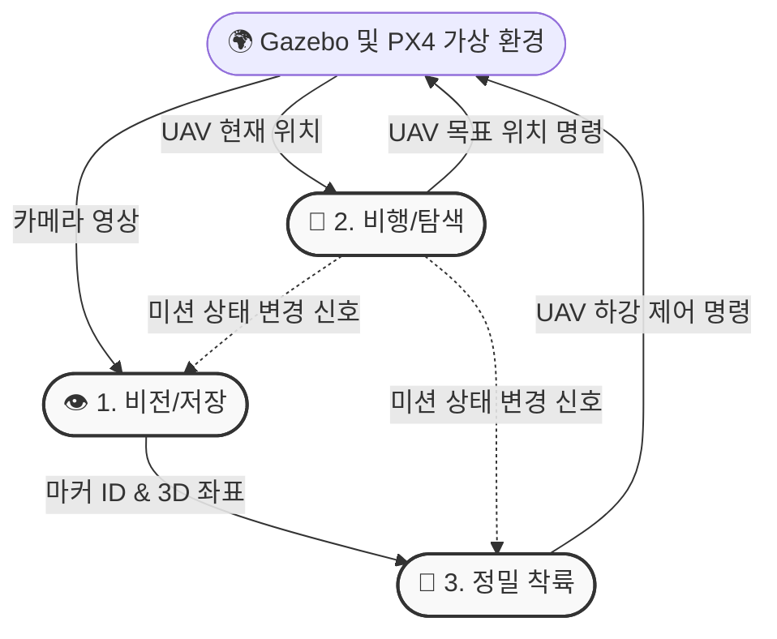

# 🚁 UAV-Vision 서브시스템 (담당자 1, 2, 3)

## 📌 시스템 아키텍처
드론의 비행, 탐색, 그리고 비전을 통한 정밀 착륙을 담당하는 파트의 ROS2 노드 및 토픽 통신 구조도입니다.

## 💻 3인 담당자별 통신 명세서
코드를 작성할 때 아래의 토픽 이름과 메시지 타입을 반드시 지켜주세요!

### 1. 승윤: 비전/마커 저장 (`/aruco_detector`)
* **Sub:** `/uav/camera/image_raw` (`sensor_msgs/Image`), `/mission_state` (`std_msgs/Int32`)
* **Pub:** `/aruco/marker_pose` (`geometry_msgs/PoseStamped`)

### 2. 재형: UAV 비행/탐색 (`/uav_waypoint_follower`)
* **Sub:** `/mavros/local_position/pose` (`geometry_msgs/PoseStamped`)
* **Pub:** `/mavros/setpoint_position/local` (`geometry_msgs/PoseStamped`), `/mission_state` (`std_msgs/Int32`)

### 3. 예림: 정밀 착륙 (`/precision_landing`)
* **Sub:** `/aruco/marker_pose` (`geometry_msgs/PoseStamped`), `/mission_state` (`std_msgs/Int32`)
* **Pub:** `/mavros/setpoint_velocity/cmd_vel` (`geometry_msgs/Twist`)
